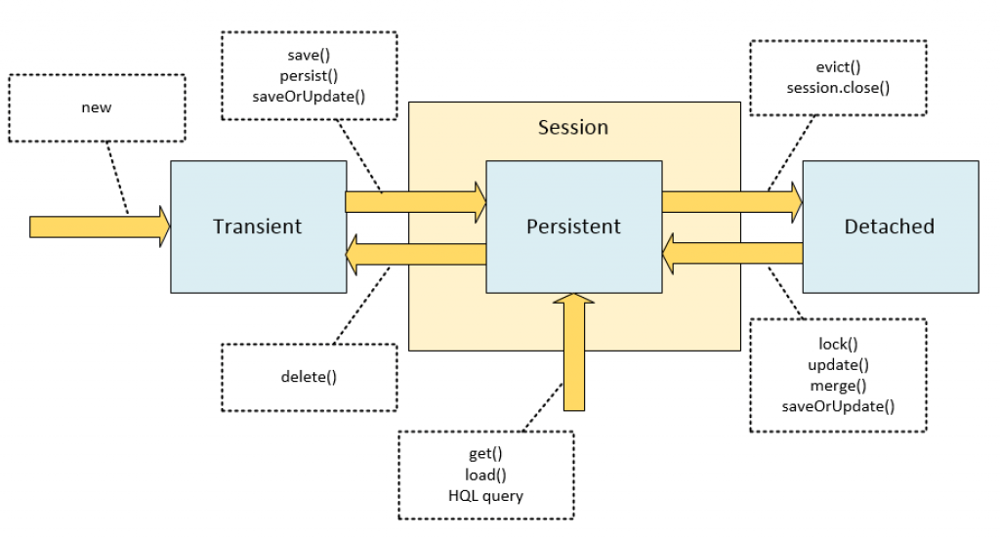

# Hibernate learning notes

#### Add maven dependency

#### hibernate

#### postgresql

#### Steps without Hibernate

### The Hibernate way

### 3 Ways of Configure Hibernate
#### 1. hibernate.cfg.xml
* configuring the connection

* configuring the mapping(annotated classes)

* configuring the session factory

#### 2. hibernate.properties
* configuring the connection

* configuring the mapping(annotated classes)

### Add annotated class to hibernate

### create a seesion factory session and user session to save model

### `@Entity(name="table_name"` vs `@Table(name"table_name")`

### create a singular name table

### use column anotation to name db column

### Hibernate Testing

>https://trello.com/c/LjsCTeyj/11-hibernate

### When hiberate create a the connection
* when configaration() load the configuration file.

### When hiberate create table?
* when add annotated class, hibernate will create table

#### @Transient
username is not saved in database

#### Primary Key
##### @NatualId
* When new Customer registers, the email should be unique, otherwise, it will throw an exception.

##### @Id
##### @GeneratedValue(strategy = GenerationType.AUTO)
##### @Genericgenerator(name = "generator", strategy = "native")
https://www.youtube.com/watch?v=rvaAx7r8lVY

##### UUID

>https://thorben-janssen.com/generate-uuids-primary-keys-hibernate/

##### interger Id

#### value object vs entity object
- value object: has no meaning without other object (address,cart)
- entity object: can exist independently (user, order, product)
- edge case: think about a order can be created by a guest(without register as a user)
- so the order has to be independent from user

### relationships
### What is a relationship?

* A relationship is a link between two objects(Entity).
* https://www.youtube.com/watch?v=C3icLzBtg8I

#### Entity vs Value Object
* If you have a value object, you can't create a relationship between two value objects.
* An value object is a object that has no meaning without other object.
* An value object will not be saved in database.
* An embedded objects will be saved in database 
* An entity object is a object that can exist independently.
* An entity object can have a relationship with other entity objects.
* An entity object can't have a relationship with value objects.
* An entity object can't have a relationship with itself.
* An entity object will be saved in the database.
#### Entity @Entity
* An entity in DBMS (Database management System) is a real-world thing or a real-world object which is distinguishable from other objects in the real world. For example, a car is an entity. An attribute of an entity gives us information about the characteristic features of an entity.
* Customer is an entity.
* Product is an entity.
* Cart is an entity.
* Order is an entity.
#### Value Object @Data
* Address is an value object.
* CartItem is an value object.
* OrderItem is an value object.

#### relationship
* `one` customer has `many` addresses
* `one` address belongs to `one` customer

* `one` customer has `many` orders
* `one` order belongs to `one` customer

* `one` order has many `order` items
* `one` order_item belongs to `one` order
  
* `one` order_item has `one` product
* `one` product belongs `many` order_item

* `one` customer has `one` cart
* `one` cart belongs to `one` customer

#### user story
##### Place a order
* when customer buy a product, frontend will create a cart
* then customer can add product to cart, then the frontend will create a cart item with product id and quantity
* before customer checkout, the frontend will never talk to backend
* all the cart_item(product_id, quantity) will be saved in the frontend local storage/session storage/cookie storage
 
* when customer checkout, he/she has to provide address and payment information.
* frontend will get the cart_item(product_id and quantity) from local storage/session storage/cookie storage
* frontend will create an json object with customer_id,  product_id, quantity, shipping_address and payment_info, send it to backend
 
* when backend receive the json object, it will create an order with customer_id, shipping_address and payment_info
* first backend will create a empty order with order_id and customer_id and pending status
* then backend will create a order_item with order_id, product_id, quantity,subtotal and save it in the database
* then backend will update the total in the order table based on the subtotal of the order_item
* then after backend verify the payment information, backend will update the status of the order to paid
* backend will send a json object with order_id, customer_id, shipping_address, payment_info, status, total, order_items to the frontend
 
* after frontend receive the json object with the order infomation from the backend, it will clear the cart_item in the local storage/session storage/cookie storage
* show the customer order received message

# Can a pendding order be in the cart?

#### JPA (Java Persistence API) @Entity
* Entities in JPA are nothing but POJOs representing data that can be persisted to the database. 
* An entity represents a table stored in a database. 
* Every instance of an entity represents a row in the table.

#### @OneToMany
 * ##### always add foreign key at the many side.
 * one user has many addresses
 * on the many side: addresses side add the foreign key user.id
 * one-side (user)

* to-many-side (address)

#### Add two addresses to one user

### Bidirectional @OneToMany
#### @OneToMany(mappedBy = "customer") 
1.  ***the relationship is on the other side (address-side)***
2.  ***the foreign key is on the other side (address-side)***
3.  ***many addddreses belong to one customer***
* Customer
  customer has the `getAddresses()` to access the addresses list

#### @ManyToOne
#### @JoinColumn(name = "customer_id") - foreign key name in the address table
* Address
  address has `setCustomer()` and `getCustomer()` to access the customer object

### Unidierctional @OneToMany
* Customer
  customer object has `getAddresses()` to access the addresses list

* Address
  address object knows nothing about the the customer object. it does not know which customer itself belongs to.
* database
  the database schemas are same for both `Bidirectional` and `Unidirectional` `One-To-Many` 

### Unidierctional vs Bidirectional
It's only from the hibernate...ORM, database schema, does not change. which one to use, it depends one, the user story.
* if user story need to check all the users use one specific address, then we need to add both @OneToMany for the customer side, and add @ManyToOne to the address side.

#### Lazy vs Eager(customer side)

##### fetch = FetchType.LAZY
* lazy: only when we need to access the address object(`customer.getAddresses()`), it will be loaded from the database.

#### fetch = FetchType.EAGER
* eager: load the address object when the customer object is loaded

#### Proxy

### @OneToOne
#### 1. Unidirectional @OneToOne
(cart_id is the foreign key in the customer table)
* add cart to hibernate configuration

* add one-to-one relationship in the Customer class

* add cart to customer

* database cart as a foreign key in the customer table

#### 2. Bidirectional @OneToOne
(customer_id is the foreign key in the cart table)
* add one-to-one relationship in the Customer class

* add one-to-one relationship in the Cart class

* add cart to customer

* database customer_id as a foreign key in the cart table

### @ManyToMany
* one cart has many products
* one prouct can be in many carts
#### 1. Unidirectional @ManyToMany
* add many-to-many relationship in the Cart class

#### 2. Bidirectional @ManyToMany

#### 3. ManyToMany with @JoinTable with additional columns

* Product-side(optional - if we want to get all orders of a certain product from the product side)

* OrderDetail-side

* Order-side

* database

### Cascade types
https://github.com/eugenp/tutorials/tree/master/persistence-modules/jpa-hibernate-cascade-type
https://www.baeldung.com/jpa-cascade-types
#### CascadeType.ALL
* CascadeType.ALL propagates all operations — including Hibernate-specific ones — from a `parent` to a `child` entity.
#### @Cascade = CascadeType.PERSIST

* Cascade Type PERSIST propagates the persist operation from a `parent` to a `child` entity. 
* when the customer entity is saved, the addresses entity belongs to the customer will be saved as well.
#### @Cascade = CascadeType.REMOVE
* Cascade Type REMOVE propagates the remove operation from a `parent` to a `child` entity.
#### @Cascade = CascadeType.MERGE
* Cascade Type MERGE propagates the merge operation from a `parent` to a `child` entity.
#### @Cascade = CascadeType.REFRESH
#### @Cascade = CascadeType.DETACH
#### @Cascade = CascadeType.REPLICATE
#### @Cascade = CascadeType.ALL

##### mvn exec
<plugin>
    <groupId>org.codehaus.mojo</groupId>
    <artifactId>exec-maven-plugin</artifactId>
    <version>3.0.0</version>
    <configuration>
        <mainClass>com.webdev</mainClass>
    </configuration>
</plugin>
`mvn exec:java -Dexec.mainClass="com.webdev.App`

### Dao (Data Access Object)
he Data Access Object Pattern, aka DAO Pattern, is an abstraction of data persistence and is considered closer to the underlying storage, which is often `table-centric`.

### Repository (Data Access Object)
As per Eric Evans' book Domain-Driven Design, the “repository is a mechanism for encapsulating storage, retrieval, and search behavior, which emulates a `collection` of objects.”
Likewise, according to Patterns of Enterprise Application Architecture, it “mediates between the domain and data mapping layers using a collection-like interface for accessing domain objects.”

### Dao + Repository

'
Then, it aggregates both sets of information and provides a domain object of the UserSocialMedia class that is handy for our business use-case. Therefore, a repository relies on DAOs for accessing data from various sources.

### Dao vs Repository
* `DAO` is an abstraction of `data persistence`. However, a `repository` is an abstraction of a `collection` of objects
* `DAO` is a `lower-level` concept, closer to the storage systems. However, `Repository` is a `higher-level` concept, closer  to the Domain objects
* `DAO` works as a data `mapping/access` layer, hiding ugly queries. However, a `repository` is a layer between `domains` and `data access layers`, hiding the complexity of collating data and preparing a domain object
* `DAO` `can't be implemented` using a repository. However, a repository can use a DAO for accessing underlying storage

### SessionFactory vs Session
* `SessionFactory` is a factory for creating `Session` objects. However, `Session` is a `higher-level` concept, closer to the Domain objects

### Transaction vs Session
* https://www.youtube.com/watch?v=HcjHJLEbtRs&list=PLSEDryV9VNWGPUN0-2R1GopFRJSggVzAH

### Transaction management

####  state changes

#### persist() vs save()

* prefer `persist()` over `save()`

#### merge() vs update()

## DAO
#### CRUD
#### ??? is it possible one object can be exist in multiple sessions???
* Don't let it happend.
* Treat every request as a single transaction.
https://www.dineshonjava.com/hibernate/crud-operations-using-hibernate-3/

### every CRUD is a single transaction

<!-- TODO CREATE -->
### CREATE

* when new Customer() is created, it is in `transient` state
* when session.save() is called, it is in `persistent` state
* when session.close() is called, it is in `detached` state

### READ

#### persistent
* when session.get() is called, it is in `persitent` state
#### detached
<!-- TODO UPDATE -->
### UPDATE
* there are two path to update a persistent object
1. start from a session.get()
2. start from a seesion.create()
#### Customer UPDATE process(service layer)
* same object can be exited in diffrent sessions, but each session does not know about the other
1. session.get(Customer.class, Customer.getId())
2. close the session(the object is in `detached` state)
3. serialize the object
4. sent the serialized object to front-end
5. front-end deserialize the object
6. make a updated json string and sent to back-end
7. back-end deserialize the object
#### Customer UPDATE(Dao layer)
1. sessionFactory.getCurrentSession()
2. session.beginTransaction()
2. Customer customer = session.get(Customer.class, 1);
3. customer.setUsername("newusername");
4. session.update(customer);
5. session.getTransaction().commit();
6. session.close(); 
### DELETE
* there are two path to delete a object
  
 1. session.delete(customer);
* * hiberate convert a persistent object to transient object
2. session.close()
* * hibernate convert a transient object to detached object

### save(), persist(), update(), merge(), saveOrUpdate()
https://www.baeldung.com/hibernate-save-persist-update-merge-saveorupdate

#### session.persist()
* session.persist(customer);
* transient --> persistent
* The generation of INSERT statements will occur only upon committing the transaction, or flushing or closing the session.
* void return
*  transient instance becomes persistent (and the operation cascades to all of its relations with cascade=PERSIST or cascade=ALL)
*  if an instance is already persistent, then this call has no effect for this particular instance (but it still cascades to its relations with cascade=PERSIST or cascade=ALL).
* If an instance is detached, we'll get an exception, either upon calling this method, or upon committing or flushing the session.
* The id won't necessarily be non-null after we call this method, so we shouldn't rely upon it.

#### session.save()
* first assigning a generated identifier.” The method will return the Serializable value of this identifier
`Long id = (Long) session.save(person);`
`Person person = new Person();`
`person.setName("John");`
`Long id1 = (Long) session.save(person);`
* The `id2` variable will differ from `id1`. The save call on a detached instance `creates a new persistent instance` and assigns it a new identifier, which results in a duplicate record in the database upon committing or flushing.

#### session.merge()
* The main intention of the merge method is to update a `persistent` entity instance with new field values from a `detached` entity instance.
* For instance, suppose we have a RESTful interface with a method for retrieving a JSON-serialized object by its id to the caller, and a method that receives an updated version of this object from the caller. An entity that passed through such `serialization/deserialization` will appear in a `detached` state.
* deerialize the object => detached entity object
* finds an entity instance by id taken from the passed object (either an existing entity instance from the persistence context is retrieved, or a new instance loaded from the database)
* copies fields from the passed object to this instance
* returns a newly updated instance

* if the entity is detached, it copies upon an existing persistent entity.
* if the entity is transient, it copies upon a newly created persistent entity.
* this operation cascades for all relations with cascade=MERGE or cascade=ALL mapping.
* if the entity is persistent, then this method call doesn't have an effect on it (but the cascading still takes place)

### session.update()
* return void
* detached --> persistent
* thorw `exception` if the entity is `persistent`

### session.saveOrUpdate()
* return void
* will persist a newly created instance of Person:

### If we don't have any special requirements, we should stick to the `persist` and `merge` methods because they're standardized and will conform to the JPA specification.

### object state changes
session.evict(person);
Long id2 = (Long) session.save(person);

### ==> Transient
* new()

### ==> Persistent
* get()
* load()
* HQL query

### Serialization, deserialization ==> Detached

### Persistent ==> Detached
* session.close()
* session.commit()
* session.evict()
  
### Persistent ==> Transient
* save()
* persit()
* saveOrUpdate()

### Detached ==> Persistent

* lock()
* update()
* merge()
* saveOrUpdate()

### Transient ==> Persistent
* save()
* persist()
* saveOrUpdate()

### Session
* persistence context - session
We can think of persistence context as a container or first-level cache for all the objects that we loaded or saved to a database during a session.
* The session is a logical transaction, with boundaries defined by the application's business logic.
* we should always have a single instance of entity for every database record that we interact with during the session.
* In Hibernate, the persistence context is represented by the org.hibernate.Session instance. For JPA, it's the javax.persistence.EntityManager. When we use Hibernate as a JPA provider, and operate via the EntityManager interface, the implementation of this interface basically wraps the underlying Session object. However, Hibernate Session provides a richer interface with more possibilities, so sometimes it's useful to work with Session directly.

### transient vs persistent vs detached (state)

#### transient 
* This instance isn't, and ***never*** was, attached to a Session. This instance has no corresponding rows in the database; it's usually just a new object that we created to save to the database.

#### persistent 
* This instance is associated with a ***unique*** Session object. Upon ***flushing*** the Session to the database, this entity is guaranteed to have a ***corresponding consistent*** record in the ***database***. 
* before flushing, it is always has a one-to-one relationship with a database record.
* When the entity instance is in the persistent state, all the changes that we make to the mapped fields of this instance will be applied to the corresponding database records and fields ***upon flushing the Session***
  
#### detached
* This instance was once attached to a Session (in a persistent state), but now it’s not. 
* An instance enters detached state:
* if we evict it from the context, 
* clear or close the Session, 
* put the instance through serialization/deserialization process.

### session.getTransaction().commit()
### session.flush()
all of the methods (persist, save, update, merge, saveOrUpdate) don't immediately result in the corresponding SQL UPDATE or INSERT statements. The actual saving of data to the database occurs upon `committing` the transaction or `flushing` the Session.

#### flush(): 
Flushing is the process of synchronizing the underlying persistent store with persistable state held in memory.it `will` update or insert into your tables in the running transaction, but it may `not` commit those changes.

#### Commit(): - the changes
Commit will make the database commit.When you have a `persisted` object and you `change` a value on it, it becomes `dirty` and hibernate needs to flush these changes to your persistence layer.So You should `commit` but it also ends the unit of work.

### Add lombok (optional)

>https://mvnrepository.com/artifact/org.projectlombok/lombok-maven-plugin

